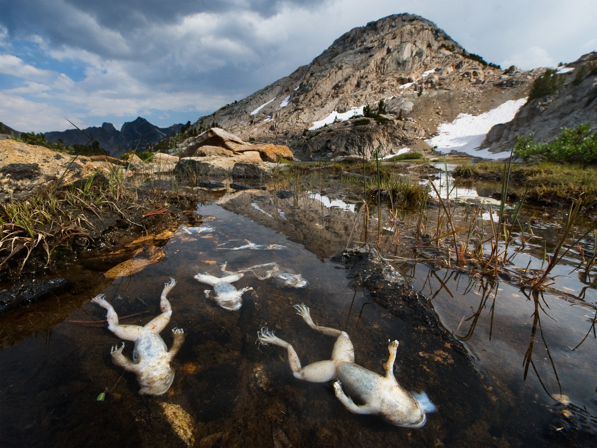

# Vertebrados
    
    Curso Virtual, Universidad de los Andes 2020-10
    Profesor: C. Daniel Cadena (ccadena@uniandes.edu.co)
    Asistente Graduado: Mateo Dávila (mm.davila@uniandes.edu.co)
    Horario: martes, miércoles y jueves, 11-11:50 am en SicuaPlus
            
# Primer Módulo: La Crisis Global de los Anfibios

    Ranas muertas por infección con el hongo *Batrachochytrium dendrobatidis* en la Sierra Nevada de California, Estados Unidos. Fotografía de [Joel Sartore](https://www.instagram.com/joelsartore/?hl=en) para National Geographic.
    
## Objetivos de aprendizaje

-	Comprender cómo aspectos de la biología de los organismos los hacen vulnerables a cambios en el ambiente.

-	Usando como estudio de caso el declive de poblaciones de anfibios, entender cómo se aplica el método científico para resolver problemas de investigación en biología.

-	Comprender los conceptos de cascada trófica y especie clave a través del estudio del papel de los anfibios en el funcionamiento de los ecosistemas evidenciado por las consecuencias de su desaparición.

## Competencias a desarrollar

-	Habilidad para leer, comprender e integrar información en el marco del método científico.

-	Capacidad de divulgar información científica para un público amplio mediante una infografía.

## Instrucciones para los estudiantes

### Martes 24 de marzo

Muchos anfibios de todo el mundo se han extinguido o están en grave peligro de extinción. En este módulo del curso estudiaremos las causas y consecuencias de las extinciones y disminuciones poblacionales de estos animales.

Como punto de partida debemos conocer quiénes son los anfibios y cuáles son sus características principales, pues esto es fundamental para cumplir con el objetivo de entender por qué son animales especialmente vulnerables ante cambios en su ambiente. En SicuaPlus encontrarán la presentación que normalmente he usado como introducción a los anfibios en versiones anteriores de este curso dictadas presencialmente. Además, en nuestra primera clase veremos un [vídeo](https://youtu.be/U2gz2ke8kik) que nos sirve como introducción al grupo. La selección de este vídeo entre muchos materiales audiovisuales posibles no es casual. Además de presentar información científicamente correcta, fue hecho por estudiantes de pregrado y por esto nos sirve como ejemplo pues una de las tareas de este módulo es que usted elabore material divulgativo sobre la crisis de los anfibios.

Desde hace más de una década, es claro que nos enfrentamos a una [crisis](https://www.pnas.org/content/105/Supplement_1/11466) en la conservación de los anfibios. Sin embargo, hasta hace relativamente poco tiempo las causas de la disminución poblacional de varias de las especies eran un misterio, tal como lo resumieron Stuart et al. en este [artículo](https://pdfs.semanticscholar.org/aaeb/e0ee4e89838171b5bccd1d6c74cfa652c280.pdf?_ga=2.51507628.421737405.1584920555-1139811814.1584920555) en Science en 2004. Déle una mirada al menos al resumen y las figuras del artículo para que se de una idea de lo que sabíamos hasta ese momento. Claro, idealmente léalo completo.

Mañana nos encontraremos a la hora de clase. Las instrucciones para el trabajo que haremos serán publicadas en esta página a las 10:45 am.

### Miércoles 25 de marzo

A lo largo de los últimos años, hemos aprendido bastante acerca de la crisis de los anfibios. Comenzaremos nuestro trabajo sobre el tema  con una introducción al problema. Dedique la hora de la clase de hoy a ver este [vídeo](https://youtu.be/1_cGPLO8dos) en el que se ilustran varias aristas del problema. Como verá, algunos de los desafíos para la conservación de anfibios son (1) la enfermedad infecciosa emergente causada por el hongo *Batrachochytrium dendrobatidis*, (2) la contaminación con pesticidas y (3) el cambio climático.

Su primera tarea consistirá en investigar y aprender independientemente sobre alguno de los tres desafíos que enfrentan los anfibios que identificamos. Para mañana jueves, piense en cuál de los tres desafíos le gustaría enfocarse para un ejercicio de estudio independiente. Nos encontraremos a la hora de clase en el espacio virtual de SicuaPlus.

### Jueves 26 de marzo

Hoy usted comenzará su tarea de investigar y aprender independientemente sobre alguno de los tres desafíos que enfrentan los anfibios que mencionamos ayer. **Escoja una** de las tres opciones descritas a continuación y siga las instrucciones. Algunos de los enlaces llevan directamente a documentos que puede descargar. Otros lo dirigen a referencias a la que puede tener acceso completo conectándose a las bases de datos de la biblioteca de la universidad.

- Si le llamó la atención el problema del hongo, use el espacio de la clase para leer esta breve [reseña](https://journals.plos.org/plosbiology/article?id=10.1371/journal.pbio.2003080) en la que la Dra. Karen Lips, una de las personas que más activamente ha investigado el problema, cuenta su historia y la de las ranas afectadas por el hongo en palabras sencillas. Vea además esta [entrevista](https://youtu.be/S8-5kx_Fc8g) en la que la investigadora colombiana (y egresada del doctorado en UniAndes) Vicky Flechas describe informalmente su investigación en el tema enfocada en la búsqueda de soluciones. Finalmente, revise este [artículo](https://science.sciencemag.org/content/363/6434/1459
) del año pasado que describió el panorama general de la crisis de los anfibios causada por el hongo y luego examine esta [crítica](https://science.sciencemag.org/content/367/6484/eaay1838.abstract
) sobre el artículo publicada la semana pasada en la revista Science. 

- Si se interesó en el tema de contaminación con pesticidas y los efectos que tienen en el desarrollo de los anfibios y otros impactos en salud, comience por usar el espacio de la clase para ver esta [charla](https://youtu.be/Hu0IXMTFY9Q) Ted del profesor Tyrone Hayes, que cuenta una historia muy interesante sobre cómo el interés en ranas que tuvo desde niño y que lo llevó a investigarlas lo llevó por el camino de hoy ser un activista de varias causas de interés para la sociedad. Luego revise este [capítulo](https://github.com/cdanielcadena/vertebrados/blob/master/relyea2011.pdf) en el que se describen diferentes estudios y debates en torno a los efectos del herbicida RoundUp sobre los anfibios. Concéntrese en leer con cuidado las partes introductorias y de conclusión, y especialmente las secciones en las que el autor describe los potenciales efectos de la fumigación con glifosato de cultivos de coca en Colombia sobre nuestros anfibios.

- Si le gustaría profundizar en los efectos del cambio climático, comience por leer este [artículo](https://www.pnas.org/content/pnas/104/20/8352.full.pdf) con un conjunto de datos único que muestra que no solo los anfibios sino también los reptiles están desapareciendo en una zona bien estudiada de bosque húmedo tropical en Costa Rica. Estudie además este [trabajo](https://www.nature.com/articles/nature04246), que detonó un fuerte debate en cuanto a si las disminuciones poblacionales que algunos científicos le habían atribuido únicamente al hongo quitridio sobre los anfibios podrían estar vinculadas causalmente con cambios en el clima. Finalmente, vea una sección de esta [conferencia](https://vimeo.com/93283825) del Dr. Winsor Lowe en la que describió datos que sugerían potenciales impactos de cambio climático sobre salamandras (comience en el minuto 30 del vídeo). Ese trabajo eventualmente condujo a un [artículo](https://www.pnas.org/content/116/39/19563) publicado el año pasado, que señaló cómo cambios en la precipitación afectan a estos anfibios interfiriendo con la metamorfosis.

Nos encontraremos el martes para una sesión de clase en la que el profesor hará una presentación que integra el material que los estudiantes habrán preparado independientemente según estas instrucciones. Venga preparado para, con base en lo que investigó, contestar la siguiente pregunta: ¿qué aspectos de la biología de los anfibios los hacen especialmente vulnerables a impactos como los de infecciones, químicos o el clima?

Finalmente, en la sesión de laboratorio de la próxima semana tendremos una discusión sobre este [estudio](https://science.sciencemag.org/content/367/6479/814) recién publicado que habla de las consecuencias de la extinción de anfibios sobre otros animales: las serpientes que se alimentan de ellos en un bosque tropical de Panamá.

### Marzo 31 - Abril 2

En las primeras dos clases los estudiantes contestaron un quiz relacionado con su trabajo independiente, y tuvimos [presentaciones](https://github.com/cdanielcadena/vertebrados/blob/master/crisis_anfibios_metodo_cientifico.pdf) sobre la crisis de conservación de los anfibios enfocándonos en cómo diferentes investigadores han seguido el método científico para avanzar en la solución de preguntas y el desarrollo de una teoría integral que explica qué está pasando con los anfibios a nivel global. Los estudiantes y el profesor de laboratorio además tuvieron una discusión sobre cómo la desaparición de anfibios afecta el funcionamiento de ecosistemas. Cerramos esta primera fase con una discusión virtual con la profesora [Karen Lips](http://lipslab.weebly.com/) de la Universidad de Maryland sobre anfibios y las causas de su declive, y más ampliamente sobre la importancia del estudio y conservación de la biodiversidad en el contexto de enfermedades emergentes.
